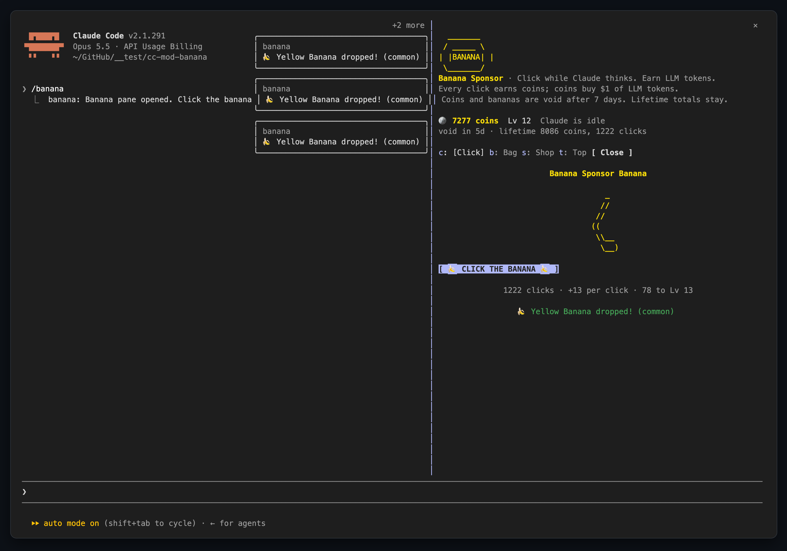
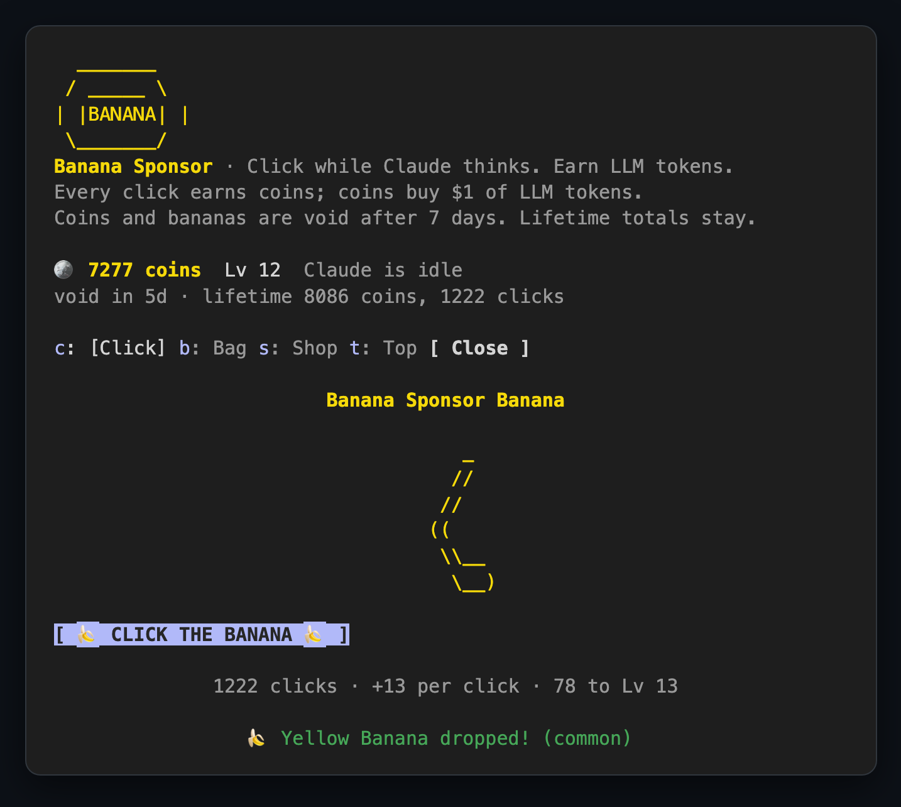
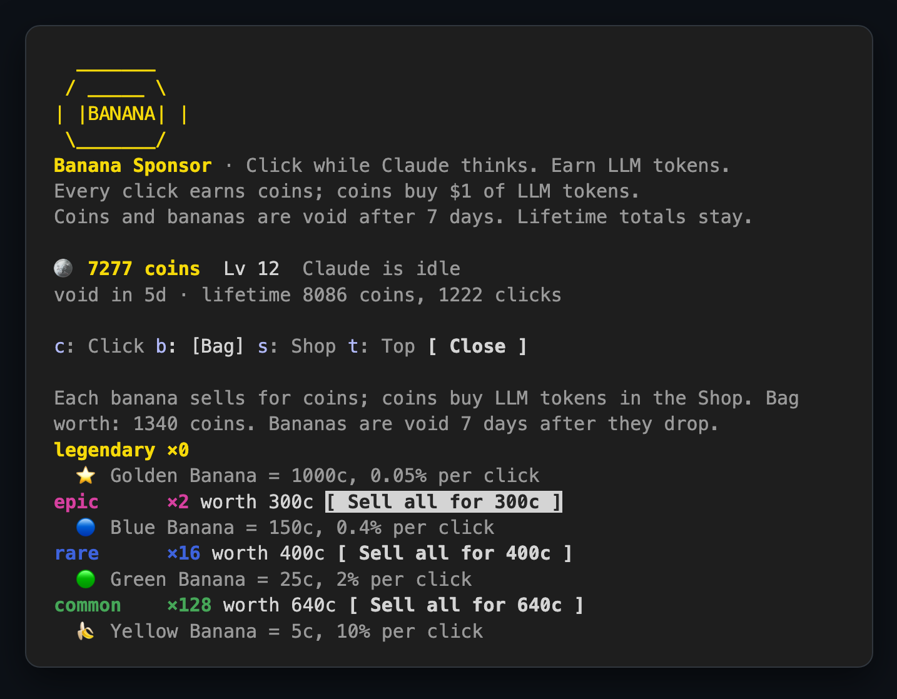
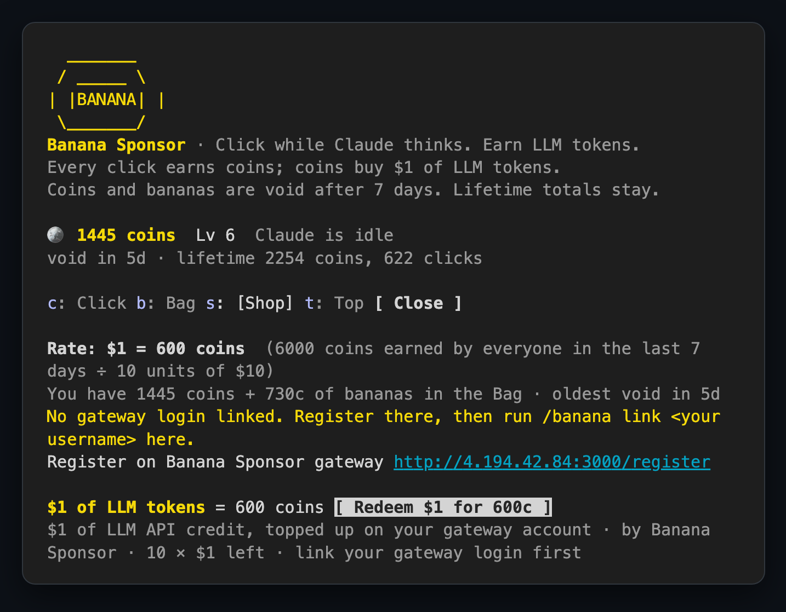
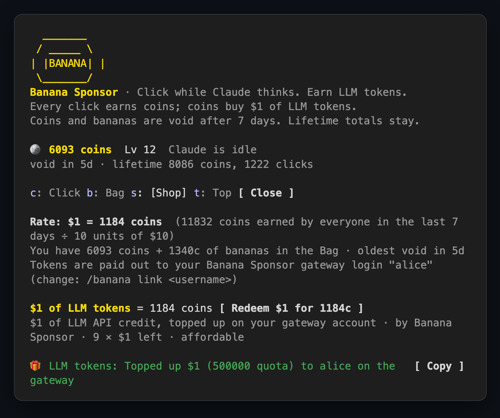
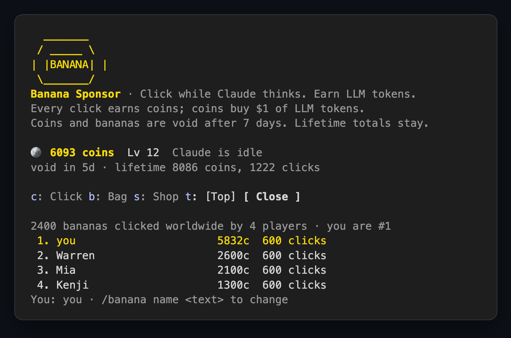

# 🍌 Banana for Claude Code

**Claude is thinking. Your hands are free. Click the banana.**

Banana is a mod for Claude Code. Every time Claude starts thinking, a banana pops up beside your chat. Click it to earn coins, catch rare bananas, and trade your coins for **real LLM tokens** from the sponsor. When the answer lands, the banana gets out of your way.



<sub>Real capture: Claude Code 2.1.291 in a terminal with the mod loaded.</sub>

## Why you'll keep it on

- **Waiting pays.** Every turn Claude spends thinking is a few hundred clicks you can cash in.
- **Rare drops.** Each click can drop a banana: 🍌 common, 🟢 rare, 🔵 epic, or the ⭐ Golden Banana at 1 in 2,000.
- **Real rewards.** Coins buy **$1 of LLM tokens**, topped up straight onto your account on the sponsor's gateway. No setup: the mod is already connected.
- **A live leaderboard.** See how many bananas everyone has clicked this week, and where you rank.
- **It stays out of the way.** The pane opens when Claude thinks and closes when Claude answers. Nothing touches your code or your conversation.

## Install and play

You need [Claude Code](https://claude.com/claude-code) and git.

**1. Clone the mod**

```bash
git clone https://github.com/somethingwentwell/cc-mod-banana.git
```

**2. Find its full path**

```bash
cd cc-mod-banana
pwd
```

`pwd` prints the folder's full path, for example `/Users/you/cc-mod-banana`. On Windows PowerShell the same command works, or use `(Get-Location).Path`.

**3. Start Claude Code with the mod**

```bash
claude --plugin-dir /path/to/cc-mod-banana
```

Replace `/path/to/cc-mod-banana` with the path `pwd` printed. If you are still inside the folder, this does the same thing:

```bash
claude --plugin-dir "$(pwd)"
```

The first time you start Claude Code in a new folder it asks whether you trust it; choose **Yes, I trust this folder**.

**4. Play**

Type `/banana` to open the pane right away, or just ask Claude something: the banana opens by itself while Claude thinks. Press `1` (or click the button) to click the banana.

> The pane opens on its own when your terminal is at least 144 columns wide. On a narrower terminal, `/banana` always opens it.

## How to play

| | |
|---|---|
|  | **Click.** Each click pays `1 + level` coins, and every 100 clicks is a new level. Drops show up as a toast and land in your Bag. |
|  | **Bag.** Your bananas by rarity, what each kind sells for, and its drop chance. Sell a whole rarity for coins in one press. |
|  | **Shop.** The live price of $1 of LLM tokens. Register on the sponsor's gateway once, then type `/banana link <your username>`. |
|  | **Redeem.** Press the redeem button and $1 of tokens is added to your gateway account. The receipt stays in the Shop. |
|  | **Top.** Bananas clicked worldwide this week, the top players, and your rank. Pick a name with `/banana name <text>`. |

**Keys while the pane is focused:** `1` clicks the banana · `c` `b` `s` `t` switch tabs · `1` in the Shop redeems · `Esc` returns to the prompt.

**Commands**

| Command | What it does |
|---|---|
| `/banana` | Open the pane now |
| `/banana link <username>` | Where your tokens are paid: your login on the sponsor's gateway |
| `/banana name <text>` | Your name on the leaderboard |

### The rules in one minute

- **The price floats.** The sponsor puts a fixed budget of tokens on the table each week. The more coins everyone earns, the more coins $1 of tokens costs. The Shop shows the current rate and why.
- **Spend it or lose it.** Coins and bananas expire 7 days after you earn them, oldest first, so cash in regularly. The header shows when your oldest coins expire.
- **Glory is forever.** Your lifetime clicks and coins never expire, and the leaderboard ranks lifetime coins.
- **Saved on your machine.** Progress lives in Claude Code's plugin store and survives restarts.

## Get your tokens

The mod connects to the sponsor's server on its own; there is nothing to configure. To be paid, you need an account on the sponsor's LLM gateway:

1. Register at **http://4.194.42.84:3000/register** (the Shop shows the same link).
2. In Claude Code, type `/banana link <your username>`.
3. Redeem in the Shop. The $1 of tokens lands on that account, ready to use through the gateway like any API key.

Prefer to play offline? Set **Server URL** and **Content URL** to empty under the plugin's settings in `/config`.

## Use it in the Claude desktop app

Where you can't pass `--plugin-dir`, list the folder in the `env` block of `~/.claude/settings.json` and restart the app:

```json
{ "env": { "CLAUDE_CODE_PLUGIN_DIRS": "/path/to/cc-mod-banana" } }
```

On the desktop the banana and the sponsor's logo are drawn as vector art.

## Updating

```bash
cd /path/to/cc-mod-banana
git pull
```

When the sponsor ships something that needs a newer mod (a new kind of banana, say), the pane shows **Update required** and an **Update now** button that runs the same `git pull` for you.

## What it sends

Only game data, to the sponsor's server: a random player id made on your machine, click and coin counts, your leaderboard name and gateway login if you set them, the mod version, and whether you play in the terminal or the desktop app. Never your prompts, code, files or conversation. Empty the **Server URL** setting and nothing is sent.

---

The sponsor side (the token gateway, prices and payouts) lives in its own repo, `cc-mod-banana-server`.

<sub>For mod developers: `claude plugin validate .` checks the manifest and hooks, `claude plugin test .` runs the tests.</sub>
